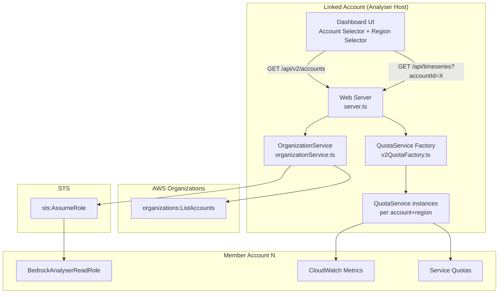
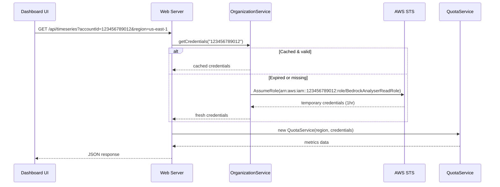

# Design Document: Multi-Account Organization Support

## Overview

This design adds AWS Organizations multi-account support to the Bedrock AI Analyser as a v2 feature. The analyser currently monitors Bedrock usage for a single AWS account. This feature enables users to view metrics from any account in their AWS Organization by selecting a target account from a searchable dropdown in the dashboard header.

The core mechanism is STS AssumeRole: a consistent IAM role (`BedrockAnalyserReadRole`) is deployed to member accounts via a CloudFormation StackSet template. When a user selects a different account, the analyser assumes that role to obtain temporary credentials, then creates new `QuotaService` instances backed by those credentials to fetch CloudWatch metrics and Service Quotas data.

All v2 code is additive. No existing v1 files (`quotaService.ts`, `predictionService.ts`, `chatService.ts`, `userStore.ts`, `config.ts`) are modified.

### Key Design Decisions

1. **New `OrganizationService` class** in `src/lib/organizationService.ts` — encapsulates account listing, credential caching, and role assumption. Follows the same pattern as existing services (constructor with region, async methods).
2. **Credential-aware QuotaService factory** — a new helper function creates `QuotaService` instances injected with cross-account credentials. Since `QuotaService` already accepts a `region` parameter, we extend this pattern by also accepting optional AWS credentials.
3. **V2 API routes added inline** in `server.ts` — new `/api/v2/accounts` endpoint and an `accountId` query parameter on existing endpoints. The existing routes remain untouched; the `accountId` parameter triggers cross-account credential resolution.
4. **Account selector UI** — a searchable dropdown added to the dashboard header HTML, next to the existing region selector. Implemented as inline HTML/JS consistent with the existing codebase style.
5. **StackSet CloudFormation template** — a new file `cloudformation/cross-account-role.yaml` that deploys the read-only IAM role to member accounts.

## Architecture



### Request Flow for Cross-Account Data



## Components and Interfaces

### 1. OrganizationService (`src/lib/organizationService.ts`)

New file. Handles account discovery and cross-account credential management.

```typescript
export interface OrgAccount {
  accountId: string;
  accountName: string;
  email: string;
  status: string;
}

export interface AssumedCredentials {
  accessKeyId: string;
  secretAccessKey: string;
  sessionToken: string;
  expiration: Date;
}

export class OrganizationService {
  private accountCache: OrgAccount[] | null;
  private accountCacheExpiry: number;
  private credentialCache: Map<string, AssumedCredentials>;
  private cacheTtlMs: number; // default 300000 (5 min) for account list

  constructor(cacheTtlMs?: number);

  /** Lists all ACTIVE accounts in the Organization. Returns [] on failure. */
  async listAccounts(): Promise<OrgAccount[]>;

  /** Returns temporary credentials for the given account, or null for the linked account. */
  async getCredentials(accountId: string): Promise<AssumedCredentials | null>;

  /** Returns the linked account's own account ID. */
  async getLinkedAccountId(): Promise<string>;
}
```

**Credential caching logic**: Credentials are cached per `accountId`. Before returning cached credentials, the service checks if they expire within 5 minutes; if so, it re-assumes the role. The role ARN is constructed as `arn:aws:iam::<accountId>:role/BedrockAnalyserReadRole`. Session duration is set to 1 hour.

### 2. V2 QuotaService Factory (`src/lib/v2QuotaFactory.ts`)

New file. Creates `QuotaService` instances with optional cross-account credentials.

```typescript
import { QuotaService } from './quotaService.js';
import { OrganizationService } from './organizationService.js';

/**
 * Creates a QuotaService for the given region and account.
 * If accountId is the linked account or undefined, returns a standard QuotaService.
 * Otherwise, assumes the cross-account role and injects credentials.
 */
export async function createQuotaServiceForAccount(
  orgService: OrganizationService,
  region: string,
  accountId?: string
): Promise<QuotaService>;
```

Since the existing `QuotaService` constructor creates its own AWS SDK clients internally, and we cannot modify it (v1 preservation), the factory will create a new `QuotaService` subclass or use the AWS SDK's credential provider chain. The approach: we create a thin wrapper `CrossAccountQuotaService` that extends `QuotaService` and overrides the constructor to inject credentials into the SDK clients.

Actually, since we must not modify `quotaService.ts`, we'll use a different approach: the factory creates standard `QuotaService` instances for the linked account, and for cross-account scenarios, it creates a `CrossAccountQuotaService` (new class in `v2QuotaFactory.ts`) that mirrors `QuotaService` but initializes SDK clients with explicit credentials.

### 3. V2 API Routes (additions to `src/web/server.ts`)

New routes and middleware added to the existing `handleRequest` function:

| Endpoint | Method | Description |
|---|---|---|
| `/api/v2/accounts` | GET | Returns list of Organization accounts |
| Existing endpoints | GET | Accept optional `accountId` query param |

When `accountId` is present on any existing data endpoint (`/api/timeseries`, `/api/quotas`, `/api/usage`, `/api/agents`, `/api/predictions`), the server resolves credentials via `OrganizationService` and creates account-specific `QuotaService` instances instead of using the default ones.

### 4. Account Selector UI

Added to the dashboard header HTML in the `getHTML()` function. Positioned between the account badge and the region selector.

```
[Account Badge] [Account Selector ▾] [Region Selector] [Model Filter] [Time Range] [Refresh]
```

The selector is a searchable `<input>` + dropdown list, implemented in vanilla JS (consistent with existing codebase). On selection change, it:
1. Updates a global `currentAccountId` variable
2. Updates the account badge display
3. Calls `loadAll()` to refresh all dashboard data
4. Appends `&accountId=<id>` to all API fetch calls

### 5. StackSet CloudFormation Template (`cloudformation/cross-account-role.yaml`)

New file. Deploys `BedrockAnalyserReadRole` to member accounts.

```yaml
Parameters:
  LinkedAccountId:
    Type: String
    Description: AWS Account ID where the Bedrock AI Analyser is deployed

Resources:
  BedrockAnalyserReadRole:
    Type: AWS::IAM::Role
    Properties:
      RoleName: BedrockAnalyserReadRole
      AssumeRolePolicyDocument:
        Version: '2012-10-17'
        Statement:
          - Effect: Allow
            Principal:
              AWS: !Sub 'arn:aws:iam::${LinkedAccountId}:root'
            Action: sts:AssumeRole
      Policies:
        - PolicyName: BedrockAnalyserReadPolicy
          PolicyDocument:
            Version: '2012-10-17'
            Statement:
              - Effect: Allow
                Action:
                  - cloudwatch:GetMetricStatistics
                  - cloudwatch:ListMetrics
                  - cloudwatch:GetMetricData
                  - servicequotas:ListServiceQuotas
                  - servicequotas:GetServiceQuota
                  - bedrock:ListFoundationModels
                  - bedrock:GetFoundationModel
                  - sts:GetCallerIdentity
                  - iam:ListAccountAliases
                Resource: '*'
```

## Data Models

### OrgAccount

| Field | Type | Description |
|---|---|---|
| `accountId` | `string` | AWS Account ID (12-digit) |
| `accountName` | `string` | Human-readable account name from Organizations |
| `email` | `string` | Root email of the account |
| `status` | `string` | Account status (only `ACTIVE` accounts are returned) |

### AssumedCredentials

| Field | Type | Description |
|---|---|---|
| `accessKeyId` | `string` | Temporary access key from STS |
| `secretAccessKey` | `string` | Temporary secret key from STS |
| `sessionToken` | `string` | Session token for temporary credentials |
| `expiration` | `Date` | When the credentials expire |

### Credential Cache Entry (internal to OrganizationService)

| Field | Type | Description |
|---|---|---|
| key | `string` | Account ID |
| value | `AssumedCredentials` | Cached credentials |
| refresh threshold | 5 minutes before `expiration` | When to re-assume the role |

### Account List Cache (internal to OrganizationService)

| Field | Type | Description |
|---|---|---|
| `accountCache` | `OrgAccount[]` | Cached list of active accounts |
| `accountCacheExpiry` | `number` | Timestamp (ms) when cache expires |
| `cacheTtlMs` | `number` | Configurable TTL, default 5 minutes |

### API Response: `/api/v2/accounts`

```json
{
  "accounts": [
    { "accountId": "123456789012", "accountName": "Production", "email": "[email]" },
    { "accountId": "234567890123", "accountName": "Staging", "email": "[email]" }
  ],
  "linkedAccountId": "111111111111"
}
```

### API Query Parameter Extension

All existing data endpoints accept an optional `accountId` query parameter:
- `/api/timeseries?region=us-east-1&accountId=123456789012`
- `/api/quotas?region=us-east-1&accountId=123456789012`
- `/api/usage?region=us-east-1&accountId=123456789012`
- `/api/agents?region=us-east-1&accountId=123456789012`
- `/api/predictions?region=us-east-1&accountId=123456789012`
- `/api/active-models?region=us-east-1&accountId=123456789012`


## Correctness Properties

*A property is a characteristic or behavior that should hold true across all valid executions of a system — essentially, a formal statement about what the system should do. Properties serve as the bridge between human-readable specifications and machine-verifiable correctness guarantees.*

### Property 1: Account mapping preserves all fields

*For any* AWS Organizations ListAccounts API response containing N accounts, the OrganizationService `listAccounts()` method should return exactly N mapped `OrgAccount` objects (after filtering), and each object's `accountId`, `accountName`, `email`, and `status` fields should match the corresponding source account's `Id`, `Name`, `Email`, and `Status` fields.

**Validates: Requirements 1.1, 1.2**

### Property 2: Account list caching avoids redundant API calls

*For any* sequence of `listAccounts()` calls made within the configured cache TTL, the underlying Organizations API should be called exactly once, and all calls should return the same account list.

**Validates: Requirements 1.3**

### Property 3: Only ACTIVE accounts are returned

*For any* Organizations API response containing accounts with mixed statuses (ACTIVE, SUSPENDED, PENDING_CLOSURE), the `listAccounts()` method should return only those accounts whose status is `ACTIVE`.

**Validates: Requirements 1.5**

### Property 4: Account display format

*For any* `OrgAccount` with a non-empty `accountName` and a 12-digit `accountId`, the display string should match the format `<accountName> (<accountId>)`.

**Validates: Requirements 2.2**

### Property 5: Account search filters by name and ID

*For any* search string and any list of `OrgAccount` objects, the filtered results should include exactly those accounts where either the `accountName` or `accountId` contains the search string (case-insensitive).

**Validates: Requirements 2.3**

### Property 6: Role ARN construction

*For any* 12-digit AWS account ID string, the OrganizationService should construct the role ARN as exactly `arn:aws:iam::<accountId>:role/BedrockAnalyserReadRole` and pass it to the STS AssumeRole call.

**Validates: Requirements 3.1, 3.2**

### Property 7: Credential cache refresh threshold

*For any* cached credential with an expiration time, if the current time is more than 5 minutes before expiration, `getCredentials()` should return the cached credential without calling STS. If the current time is within 5 minutes of expiration, `getCredentials()` should call STS to obtain fresh credentials.

**Validates: Requirements 3.4**

### Property 8: Linked account uses default credentials

*For any* call to `getCredentials()` where the account ID matches the linked account's own ID (or is undefined/null), the method should return `null` (indicating default credentials) and should not call STS AssumeRole.

**Validates: Requirements 3.6, 5.3**

### Property 9: Cross-account QuotaService uses assumed credentials

*For any* member account ID and region, the QuotaService factory should produce a QuotaService instance whose underlying SDK clients are configured with the temporary credentials obtained from STS AssumeRole for that account.

**Validates: Requirements 4.5, 5.4**

### Property 10: Graceful degradation to single-account mode

*For any* scenario where the OrganizationService fails to list accounts (API error, no permissions, no Organization), the system should continue to function using the linked account's default credentials, and the account selector should show only the "Current Account" option.

**Validates: Requirements 7.2, 7.3**

## Error Handling

| Scenario | Behavior | HTTP Status |
|---|---|---|
| `organizations:ListAccounts` fails | Return empty account list, log error, dashboard works in single-account mode | N/A (internal) |
| `sts:AssumeRole` fails for a member account | Return error message indicating role not configured in target account | 403 |
| `accountId` param references non-existent account | Return error that account was not found in the Organization | 400 |
| Cross-account CloudWatch/Quotas call fails | Return error for that specific data section, other sections unaffected | 500 |
| Cached credentials expired and refresh fails | Clear cache entry, return AssumeRole error | 403 |
| No Organization available (not an org member) | Graceful degradation to single-account mode, account selector shows only "Current Account" | 200 (normal) |

### Error Response Format

All v2 error responses follow the existing pattern:

```json
{
  "error": "Descriptive error message"
}
```

For cross-account failures specifically:

```json
{
  "error": "Cannot access account 123456789012: BedrockAnalyserReadRole is not configured or cannot be assumed. Deploy the StackSet template to enable cross-account access."
}
```

## Testing Strategy

### Property-Based Testing

Property-based tests will use [fast-check](https://github.com/dubzzz/fast-check) for TypeScript. Each property from the Correctness Properties section will be implemented as a single property-based test with a minimum of 100 iterations.

Each test will be tagged with a comment referencing the design property:
```typescript
// Feature: multi-account-org-support, Property 1: Account mapping preserves all fields
```

**Key generators needed:**
- `arbOrgAccount`: Generates random OrgAccount objects with valid 12-digit account IDs, random names, emails, and statuses
- `arbAccountList`: Generates lists of OrgAccount objects with mixed statuses
- `arbSearchString`: Generates random search strings (substrings of account names/IDs, empty strings, non-matching strings)
- `arbCredentialExpiration`: Generates Date objects relative to "now" for testing cache refresh logic

### Unit Testing

Unit tests complement property tests by covering:
- Specific examples: known account lists, specific ARN formats
- Edge cases: empty account lists, API failures, expired credentials, malformed account IDs
- Integration points: API endpoint routing, query parameter parsing, HTTP status codes
- CloudFormation template validation: role name, trust policy, permissions list

### Test Organization

```
src/lib/__tests__/
  organizationService.test.ts    — Properties 1-3, 6-8, 10 + edge cases
  v2QuotaFactory.test.ts         — Property 9 + edge cases
  accountFilter.test.ts          — Properties 4-5
```

### Mocking Strategy

- AWS SDK clients (`OrganizationsClient`, `STSClient`) are mocked to avoid real API calls
- `QuotaService` instances are verified to receive correct credential configuration
- Time-dependent tests (credential caching) use a controllable clock/timer

### Test Configuration

- fast-check: `{ numRuns: 100 }` minimum per property test
- Jest or Vitest as the test runner (consistent with project setup)
- All property tests reference their design document property number in comments
